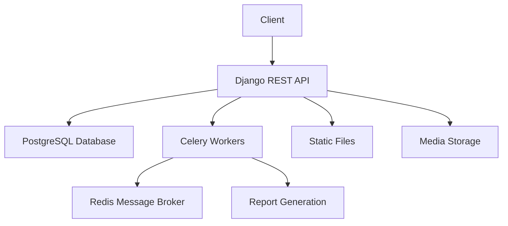

# 📚 Library Management System

> A modern Django-based Library Management System with RESTful APIs, real-time task processing, and comprehensive book management features.

[](https://www.python.org/downloads/)
[](https://www.djangoproject.com/)
[](https://www.docker.com/)
[](LICENSE)

## ✨ Features

- 📖 **Book Management**
  - Categorization and tagging
  - ISBN validation and metadata fetching
  - Availability tracking
  - Author profiles and relationships
  - Book-author statistics

- 🔒 **Security & Authentication**
  - JWT-based authentication
  - Role-based access control
  - Password reset functionality

- 📊 **Reporting System**
  - Real-time statistics with Celery
  - Automated periodic reports (daily/monthly)
  - Custom report generation
  - Borrowing analytics
  - Late returns tracking

- 📱 **API & Documentation**
  - RESTful API with versioning
  - Swagger UI documentation
  - ReDoc alternative documentation
  - Interactive API testing

## 🏗️ Architecture



## 🚀 Quick Start

### Prerequisites
- Docker (20.10+)
- Docker Compose (2.0+)
- Git

### Installation

1. **Clone the Repository**
```bash
git clone <repository-url>
cd library_management_system
```

2. **Environment Setup**
Create `.env` file in project root:
```env
DB_NAME=your_db_name
DB_USER=your_db_user
DB_PASSWORD=your_db_password
DB_HOST=your_db_host
DB_PORT=your_db_port
CELERY_BROKER_URL=redis://redis:6379/0
CELERY_RESULT_BACKEND=redis://redis:6379/0
DJANGO_SECRET_KEY=your_secret_key
```

3. **Build and Start Services**
```bash
# Start all services
docker-compose up --build -d

# Initialize database
docker-compose exec web python manage.py migrate
docker-compose exec web python manage.py createsuperuser
docker-compose exec web python manage.py collectstatic --no-input
```

4. **Access Points**
- Application: http://localhost:8000
- Admin Panel: http://localhost:8000/admin
- API Docs: http://localhost:8000/swagger/
- Alternative Docs: http://localhost:8000/redoc/

## 📁 Project Structure

```
library_management_system/
├── 📁 core/                # Project configuration
├── 📁 authors/            # Author management
├── 📁 books/              # Book management
├── 📁 borrowrecords/      # Borrowing system
├── 📁 reports/            # Report generation
├── 📁 static/             # Static assets
├── 📁 media/              # User-uploaded content
├── 📄 requirements.txt    # Dependencies
├── 📄 Dockerfile         # Docker configuration
├── 📄 docker-compose.yml # Docker services
└── 📄 manage.py          # Django management
```

## 🧪 Testing

```bash
# Run all tests
python manage.py test
```

🛠️ Local Development Commands
```bash
# Start development server
python manage.py runserver

# Start development server on different port
python manage.py runserver 8080

# Create database tables
python manage.py migrate

# Make migrations after model changes
python manage.py makemigrations

# Collect static files
python manage.py collectstatic

# Create superuser
python manage.py createsuperuser

# Start Celery worker
celery -A core worker -l info

# Start Celery beat scheduler
celery -A core beat -l info

# Shell access
python manage.py shell

# Clear project cache
python manage.py clearcache

# Show all migrations
python manage.py showmigrations
```

## 🛠️ Development Commands

```bash
# View logs
docker-compose logs -f

# Rebuild specific service
docker-compose up -d --build web

# Stop all services
docker-compose down

# Remove containers and volumes
docker-compose down -v
```

## 🤝 Bonus Features Implemented
- [x] Include proper error handling and meaningful response messages for all operations.
- [x] Write unit tests for at least 2 endpoints of your choice.
- [x] API Documentation using Swagger or DRF-YASG.
- [x] Dockerize the application for easy deployment.
- [x] Add user authentication (JWT or session-based) for secured endpoints.

---

<div align="center">
Made with ❤️ by Prashant Tomar
</div>
